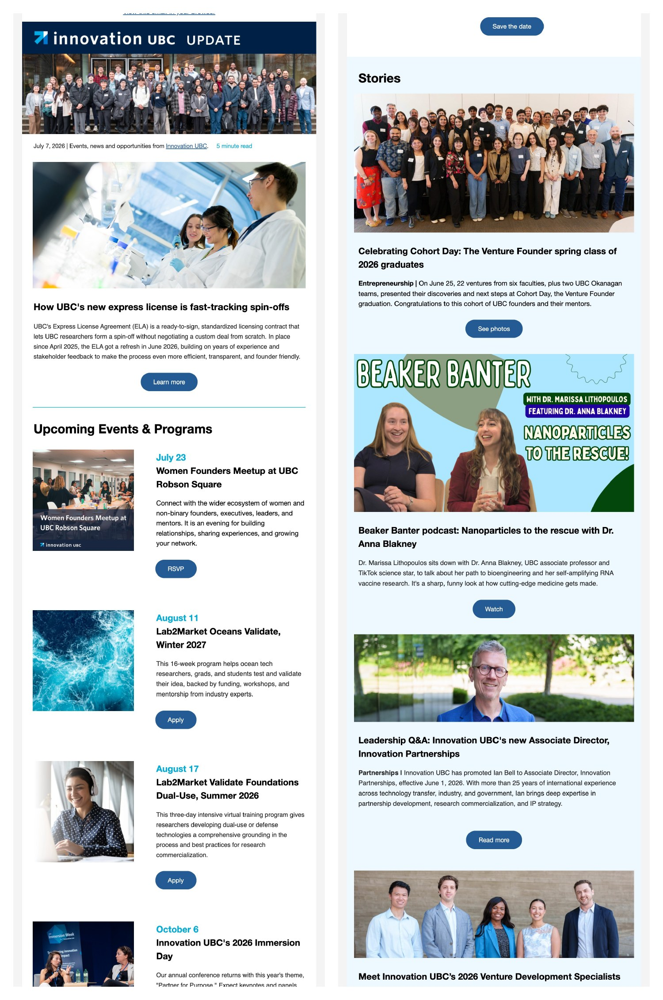
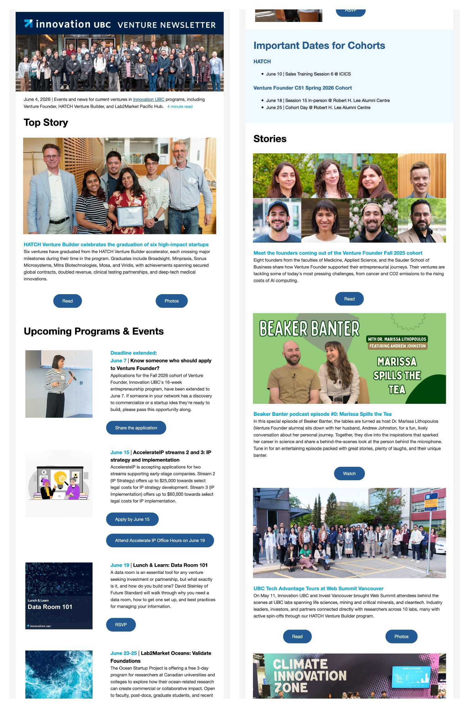
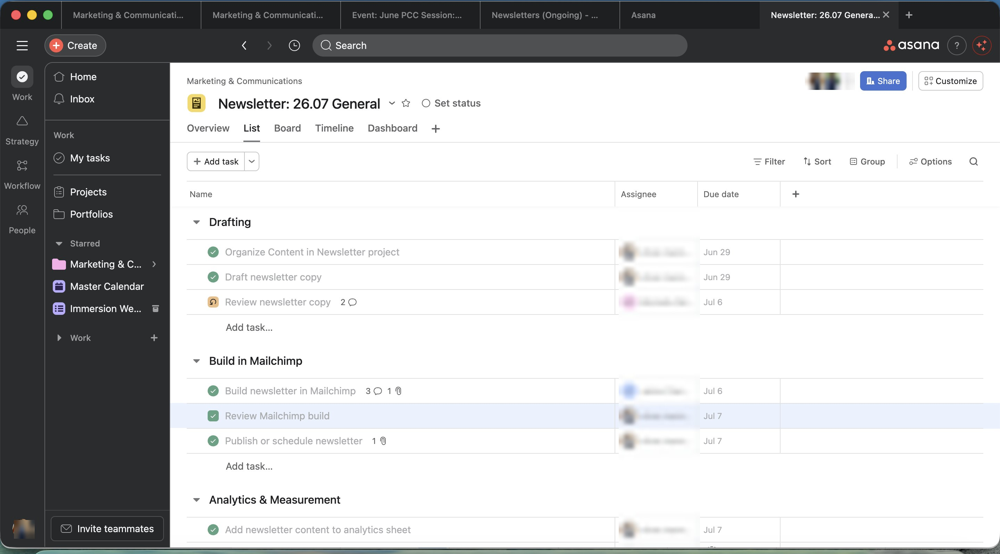

In my first month at Innovation UBC, I was asked to make the monthly newsletter actually monthly. Six months later, there are two.

## Situation

I joined Innovation UBC as Senior Manager, Marketing and Events in January 2026. A consistent monthly newsletter for the unit's 7,500 subscribers had long been a goal, but in practice the send calendar tended to follow whatever event needed promoting next. Relaunching the newsletter was one of my first assignments, and the first edition had to ship within the month.

## What I did

- Ran a quick audit of past sends, then rebuilt the newsletter on a structure I've been refining across three UBC units since my Community Engagement days: top story, upcoming events and programs, stories, venture news, community opportunities, and a resource spotlight. A good newsletter architecture is portable. The one I built for Asian Studies still runs on it.
- Protected the monthly cadence by giving events a permanent home inside the structure. When events have their own section, they stop competing with the newsletter for the calendar.
- Started the visual redesign myself to get the first editions out the door, then handed it to our in-house creative specialist, who brought it to the standard it holds today.
- Built the editorial operation in Asana: a standing intake project where teammates submit content year-round, plus a per-edition project from a template that tracks planning, drafting, copy review, the Mailchimp build, and analytics. The newsletter stopped being a solo scramble and became a repeatable team process.
- Created a custom Claude skill to accelerate drafting. I worked through the process manually with Claude for a few editions, and once I trusted the output, I asked it to turn my process into a reusable skill: outline first, my section rules, my style rules. The writing time only dropped a little. The research and assembly time is where the hours came back. A full edition now comes together in one focused morning.
- Cleaned up Mailchimp. We inherited more than a dozen inactive audiences, so we consolidated everything, sent one re-invite campaign to 2,223 lapsed contacts, and retired everyone who didn't opt back in. Better deliverability, lower costs, honest numbers.
- Launched a second monthly newsletter for current and alumni ventures in our programs, with private events, cohort dates, and stories reframed for founders.

## Results

- Seven consecutive monthly editions since January 2026. Read the [June](https://us7.campaign-archive.com/?u=6912f2b3ab92991c5324b89d1&id=f0d7ca4478) and [July](https://us7.campaign-archive.com/?u=6912f2b3ab92991c5324b89d1&id=2681fbdcad) editions.
- The General list grew from roughly 7,500 to over 8,200 subscribers, with open rates holding at 30 to 35 percent.
- The re-invite campaign reached a 41.8 percent open rate, brought 100 subscribers back, and let us retire the rest with a clear conscience.
- The [Venture newsletter](https://mailchi.mp/3b52615b5331/innovation-ubcs-venture-newsletter-july-2026) doubled from 190 to 385 recipients in six months, with open rates between 36 and 51 percent. Leadership has since expanded its mandate to include Lab2Market ventures and program alumni.

## What I'm still figuring out

The two newsletters overlap more than I'd like, and I'm still working out how to differentiate them without doubling the workload. The Claude skill also keeps evolving. Every edition surfaces an edge case, and the skill gets a little better when I fold the fix back in. If you're a communicator curious about the Asana setup or the skill itself, ask me. Sharing the process is half the point.

## Skills demonstrated

Email marketing · Copywriting · Editorial strategy · Analytics · AI workflow design · Project management
